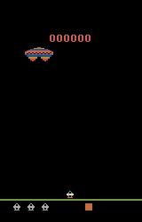
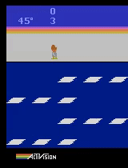

# Neuroevolution on Atari

Run Neuroevolution algorithms to train neural networks to play atari games.

It's not quite super human, but it's a start.

 

 
 

 
 

### To Run

Go into the GA or GA_0 directory, open Bash and type

`python ga_run.py frostbite.json`

to run the GA to learn how to play frostbite. `frostbite.json` will be updated. Frostbite can 
be replaced with other jsons for different games. The json file has the hyper-parameters 
for the algorithm. `does_it_generalise.py` can be used to create videos of the top 
performing individuals from the run. Type

`python does_it_generalise.py frostbite.json`

where the json file has been updated after running the earlier command.